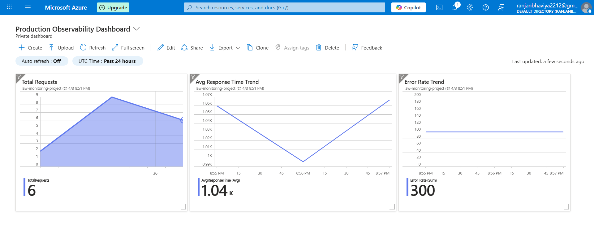

# 🔭 Azure Observability & Monitoring System with Grafana

An end-to-end production observability solution built using **Azure Monitor**, 
**Log Analytics Workspace**, and **Grafana** — covering the full monitoring 
lifecycle from log ingestion to real-time dashboards and automated alerting.

---

## 🔍 Overview

This project simulates a real-world production monitoring environment. 
A Python script generates application logs simulating realistic 
traffic — with randomized success/error statuses, response times, and error 
counts — and sends them directly to **Azure Log Analytics** via the HTTP 
Data Collector API.

The ingested logs are then:
- Visualized in real-time using **Azure Monitor Dashboard** and **Grafana**
- Analyzed using **KQL (Kusto Query Language)** queries
- Monitored via automated **Azure Alert Rules** that trigger on high error 
  rates and latency spikes

---

## 🏗️ Architecture
Python Log Generator
│
▼
Azure Log Analytics Workspace (via HTTP API)
│
├──► Azure Monitor Dashboard
│         └── Total Requests | Avg Response Time | Error Rate Trend
│
├──► Grafana Dashboard
│         └── Success Vs Error | System Health | Slow Requests | Latency
│
└──► Azure Alert Rules (KQL-based)
└── High Error Rate Alert | High Latency Alert
│
▼
Email Notification
---

## 🛠️ Tech Stack

| Tool | Purpose |
|---|---|
| Azure Log Analytics Workspace | Log ingestion and storage |
| Azure Monitor | Cloud-native dashboard and alerting |
| Grafana | Advanced visualization and observability |
| KQL (Kusto Query Language) | Log querying and alert conditions |
| Python | Log simulation and HTTP data ingestion |

---

## ⚙️ How It Works

1. **Log Generation** — Python script generates randomized application logs 
   with `Status` (Success/Error), `ResponseTime` (ms), `ErrorCount`, 
   and `TimeGenerated` fields every 5 seconds

2. **Log Ingestion** — Logs are sent to Azure Log Analytics Workspace 
   via HTTP POST using HMAC-SHA256 authenticated API calls

3. **KQL Analysis** — Custom KQL queries extract key metrics like 
   error rates, average response times, slow requests, and latency 
   distribution from raw log data

4. **Real-Time Dashboards** — Azure Monitor and Grafana dashboards 
   visualize metrics in real-time across multiple panel types

5. **Automated Alerting** — KQL-based alert rules in Azure Monitor 
   trigger email notifications when error rate or latency exceeds 
   defined thresholds

6. **Incident RCA** — Log queries used to identify, investigate, 
   and document root cause of simulated incidents

---

## 📊 Key Metrics Monitored

- ✅ Total Request Count
- ✅ Average Response Time Trend
- ✅ Error Rate Trend
- ✅ Success vs Error Ratio
- ✅ Slow Requests Trend
- ✅ Latency Distribution

---

## 🚨 Alert Rules Configured

| Alert Name | Condition | Signal Type | Status |
|---|---|---|---|
| High Error Rate Alert | Table rows > 5 | KQL Log Search | Enabled |
| High Latency Alert | Table rows > 500 | KQL Log Search | Enabled |

---

## 📸 Screenshots

### Azure Monitor Dashboard

### Grafana Dashboard

---

## 🚀 How to Run

1. Create an Azure Log Analytics Workspace
2. Set your `WORKSPACE_ID` and `SHARED_KEY` as environment variables
3. Install dependencies — `pip install requests`
4. Run `python log_generator.py`

> 📌 Note: You will need your own Azure subscription
> and Log Analytics Workspace credentials to run this project.

---

## 📁 Project Structure
azure-observability-monitoring-project/
│
├── azure-dashboard/
│   └── Azure-Dashboard.PNG
│
├── grafana/
│   └── Production-Observability-Dashboard.PNG
│
├── kql-queries/
│   └── error-rate.kql
│   └── latency-distribution.kql
│   └── slow-requests.kql
│
├── python-scripts/
│   └── log_generator.py
│
└── README.md

---

## 👩‍💻 Author
**Bhaviya Baskar** 
Azure Cloud & Observability Engineer
|[GitHub](https://github.com/BhaviyaBaskar)
